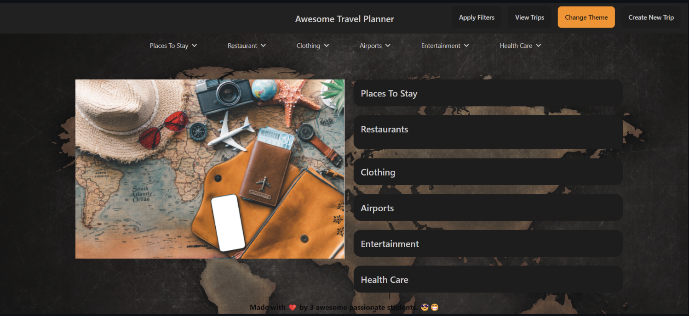
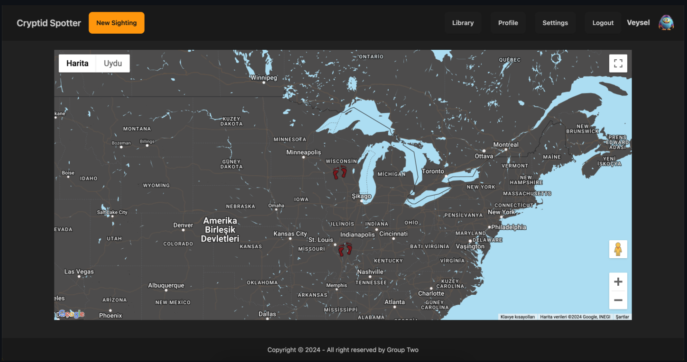
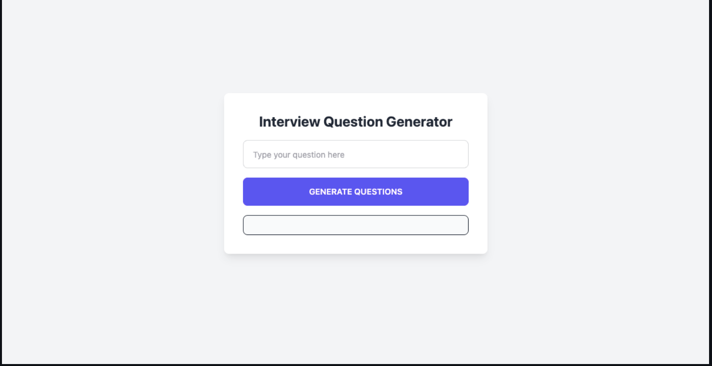
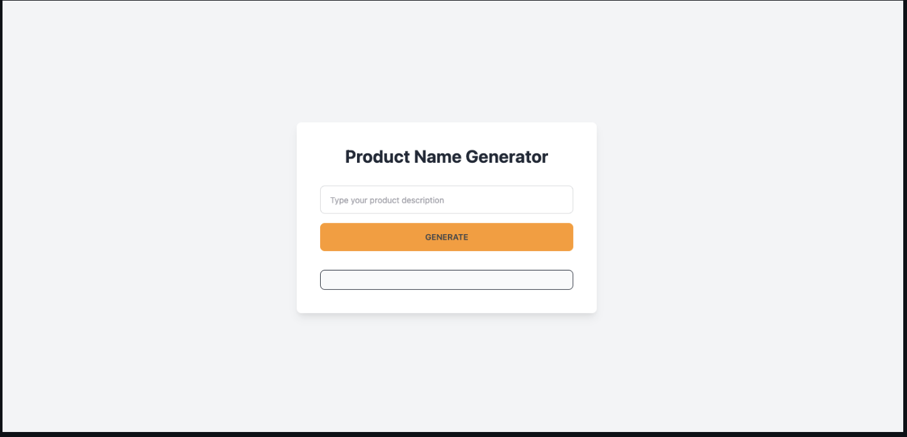
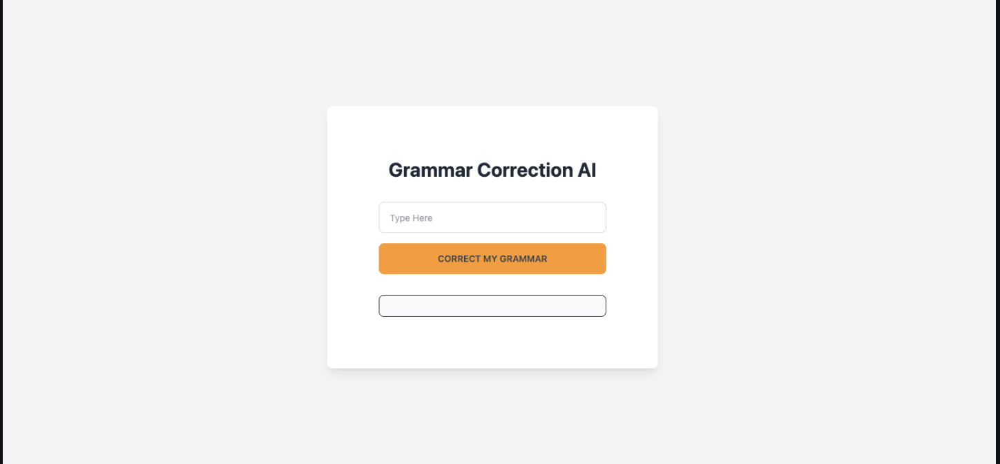
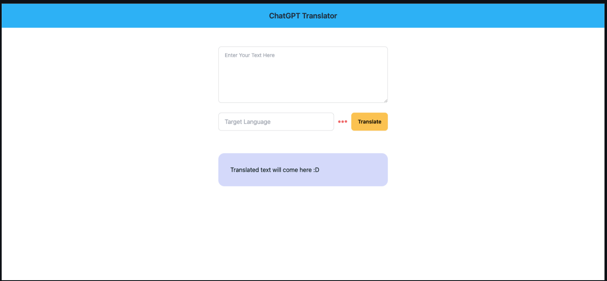
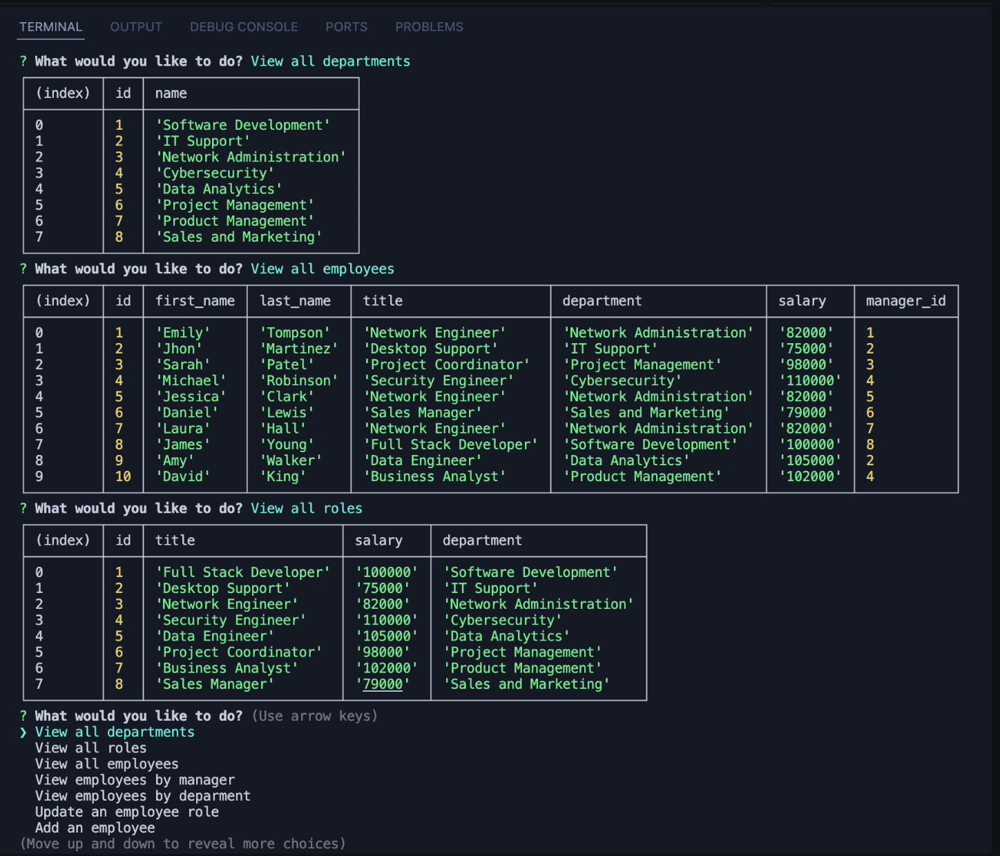
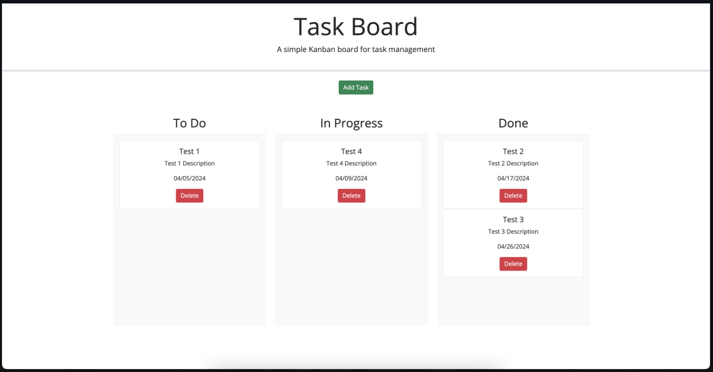
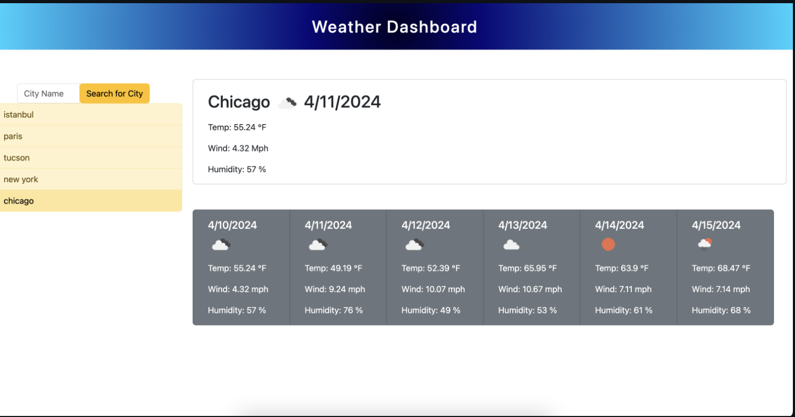

## Portfolio-React

## Veysel Arslan's Portfolio

Welcome to my portfolio website! Here you'll find a collection of my projects, showcasing my skills and passion for full stack web development and AI.

## About Me

My name is Veysel Arslan. I am a 26-year-old full stack web developer originally from Turkey, now based in Chicago, USA. With a background in civil engineering, I transitioned to web development due to my love for coding. I've created various projects related to AI and I am continually exploring new technologies.

## Technologies Used In This React Portfolio Page
- HTML
- CSS
- DaisyUI
- JavaScript
- Express
- React
- Vite

## Projects

Here are some of the projects I've worked on:

### [Travel Planner](https://github.com/veyselarslan12/travel-planning-project?tab=readme-ov-file)
An application to help users plan trips, find attractions, malls, pharmacies, restaurants, and more. Users can save multiple trips for future reference.

### [Cryptid Spot](https://github.com/veyselarslan12/cryptid-spot)
A unique application that allows users to spot and log cryptids in various locations.

### [Interview Questions Generator](https://github.com/veyselarslan12/interview-question-generator)
An AI-powered tool that generates interview questions for different job roles to help candidates prepare.

### [Product Name Generator](https://github.com/veyselarslan12/product-name-generator)
A creative tool that uses AI to generate unique product names for businesses and entrepreneurs.

### [Grammar Correction AI](https://github.com/veyselarslan12/grammar-correction-ai)
An AI-based application that corrects grammatical errors in texts, improving writing quality.

### [ChatGpt Translator](https://github.com/veyselarslan12/chatgpt-translator)
An AI translator tool that leverages the power of ChatGPT for accurate translations.

### [Employee Payroll Tracker](https://github.com/veyselarslan12/employee-tracker-postgres)
A comprehensive application to track employee payroll and manage other HR-related tasks.

### [Task Board App](https://github.com/veyselarslan12/task-board)
A task management application to help users organize and prioritize their tasks efficiently.

[Live Demo](https://veyselarslan12.github.io/task-board/)

### [Weather Forecast App](https://github.com/veyselarslan12/weather-forecast)
An application that provides accurate and up-to-date weather forecasts for any location.

[Live Demo](https://veyselarslan12.github.io/weather-forecast/)

## Links
- [Github Page](https://github.com/veyselarslan12)
- [YouTube Channel](https://www.youtube.com/channel/UCDHukZu7c3riXp0Ahtc_s9Q)
- [Deployed Portfolio Website Link](https://rad-sprinkles-4413a0.netlify.app/)

